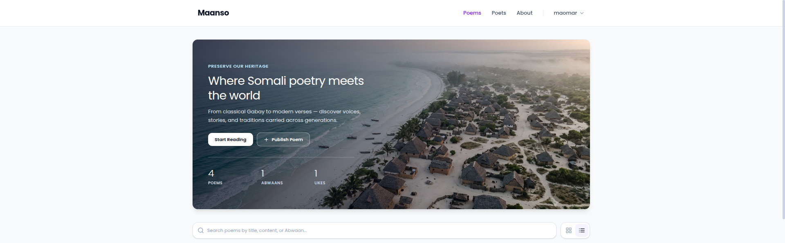
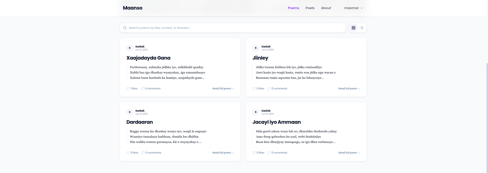
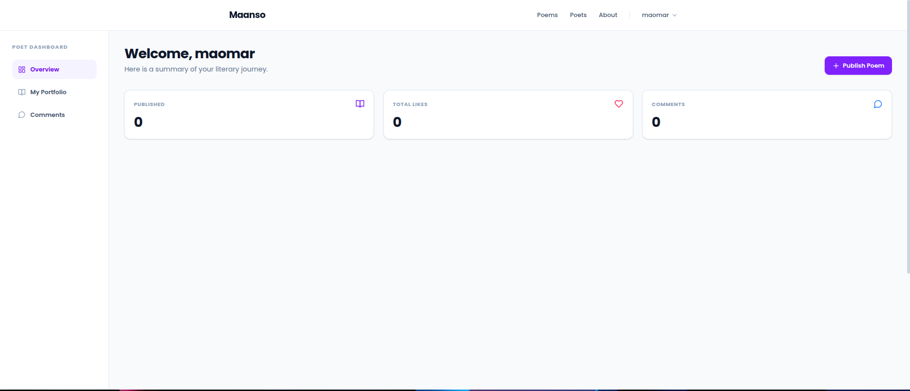
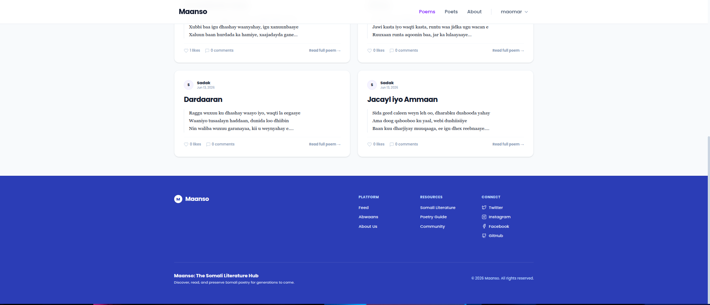

# Maanso — Somali Poetry Platform

> A digital home for Somali literary heritage. Preserve, publish, and discover Gabay poetry online.

---

## Screenshots





---

## About

Somali poetry (Maanso / Gabay) is a central part of Somali culture, but much of it is scattered, passed down orally, or difficult to find in one place. Maanso solves this by providing a structured web platform where poets, readers, and administrators can preserve and engage with Somali literature — keeping it alive for future generations.

---

## Features

- **Authentication** — Register, login, logout, and token refresh with role-based access
- **Three Roles** — Admin, Abwaan (Poet), and Viewer
- **Gabay CRUD** — Poets publish, edit, and delete their own poems
- **Community** — Like and comment on poems; authors and admins can moderate comments
- **Poem Feed** — Search by title, content, or poet name with pagination and grid/list views
- **Poet Dashboard** — Stats overview and full management of own poems and comments
- **Admin Dashboard** — Platform statistics, user role management, and full content moderation
- **Security** — bcrypt password hashing, JWT (access + refresh), rate limiting, CASL permissions

---

## Tech Stack

### Backend
- Node.js + Express 5
- MongoDB + Mongoose
- JWT via `jose` — access and refresh tokens
- bcryptjs — password hashing
- CASL (`@casl/ability`) — role-based permissions
- express-rate-limit, cookie-parser, CORS

### Frontend
- React 18 + Vite
- Tailwind CSS v4
- TanStack React Query — server state and caching
- TanStack React Router — routing
- Axios, Lucide React

---

## Getting Started

### Prerequisites
- Node.js >= 18
- MongoDB (local or Atlas)

### Backend
```bash
cd Backend
npm install
cp .env.example .env   # fill in your values
npm run dev
```

### Frontend
```bash
cd Frontend
npm install
npm run dev
```
## Project Structure
Maanso/

├── Backend/

│   ├── src/

│   │   ├── features/      # auth, gabays, users, admin

│   │   ├── middleware/

│   │   └── utils/

│   └── server.js

└── Frontend/

└── src/

├── api/

├── components/

├── context/

├── lib/

├── pages/

└── screenshots/

---

## Project Structure
